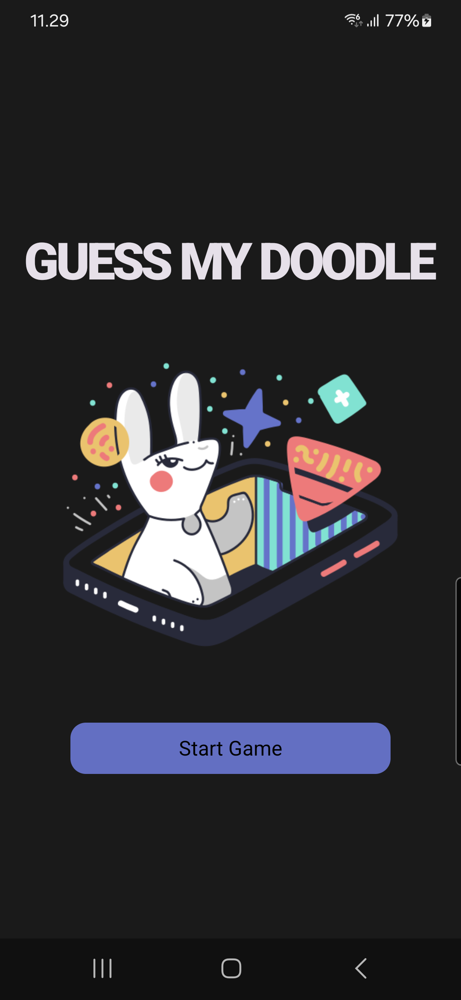

# 🎨 Guess My Doodle


**Guess My Doodle** is an Android app where one player draws a given word, and the other tries to guess what it is. The app is built using **Kotlin** and **Jetpack Compose** in Android Studio and connects players via **Bluetooth**. The goal is to blend creativity and collaboration in a fun mobile experience.

---

<details>
  <summary>Table of Contents</summary>
  
1. [Features](#features)
2. [Technologies and Tools](#technologies-and-tools)
3. [Installation](#installation)
4. [Screenshots](#screenshots)
5. [Architecture](#architecture)
6. [Testing](#testing)
7. [Project Status](#project-status)
8. [Roadmap](#roadmap)
9. [Developers](#developers)
10. [License](#license)

</details>

---

<div align="center">
  
</div>

## Features
- ✏️ Draw using the touchscreen
- 🔄 Random word generation
- 📱 Bluetooth connection between two devices
- 🧩 Word guessing logic
- ⚡ Real-time interaction
- 🎨 Clean and responsive UI with Jetpack Compose, utilizing a custom theme


## Technologies and Tools

- **Kotlin** – Primary language
- **Jetpack Compose** – Modern UI toolkit
- **Android Studio** – Development environment
- **Kotlin-BLE** – For peer-to-peer communication


## Installation

1. Make sure you have Android Studio (Bumblebee or newer) installed.
2. Clone the project:
   ```bash
   git clone https://github.com/Samupietila/MobiilisovellusProjekti.git
3. Open the project in Android Studio.
4. Run the app on two physical Android devices to test Bluetooth features.
   

## Screenshots




## Architecture

The app follows the **MVVM (Model-View-ViewModel)** pattern to separate UI and logic.
It uses **Jetpack Compose** for the UI, **Bluetooth (Kotlin-BLE)** for real-time device-to-device communication, and **ViewModel** for state management.
Asynchronous operations are handled using **Kotlin Coroutines**, and **Room** is used for local data storage.

## Testing

- Instructions or strategy on how the app is tested (unit tests, UI tests, etc.) coming soon.


## Project Status
- MVP Completed
- Polish & Improvements in Progress

## Roadmap
- [ ] 📊 Track player scores and game statistics
- [ ] 👥 Add support for multiplayer/group mode (more than 2 players)
- [ ] 🧾 Add game history tracking (view past games and results)
- [ ] 🌍 Explore cross-platform support with Kotlin Multiplatform
- [ ] 📇 Implement contact system for inviting friends

## Developers

| [@jukkiss](https://github.com/jukkiss) | [@samupietila](https://github.com/samupietila) | [@mikagronroos2](https://github.com/mikagronroos2) | [@annikannisto](https://github.com/annikannisto) |
|:--:|:--:|:--:|:--:|
|  |  |  |  |


## License
