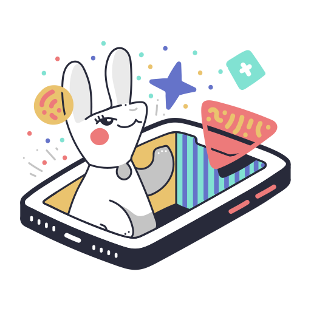

# 🎨 Guess My Doodle
<div align="center">
  
</div>

**Guess My Doodle** is an Android app where one player draws a given word, and the other tries to guess what it is. The app is built using **Kotlin** and **Jetpack Compose** in Android Studio and connects players via **Bluetooth**. The goal is to blend creativity and collaboration in a fun mobile experience.

---

<details>
  <summary>📑 Table of Contents</summary>
  
1. [Features](#-features)
2. [Technologies & Tools](#-technologies--tools)
3. [Installation](#-installation)
4. [Screenshots](#-screenshots)
5. [Architecture](#-architecture)
6. [Testing](#-testing)
7. [Folder Structure](#-folder-structure)
8. [Project Status](#-project-status)
9. [Roadmap](#-roadmap)
10. [Developers](#-developers)
11. [License](#-license)

</details>

---

## 📱 Features

- Draw using the touchscreen
- Random word generation
- Bluetooth connection between two devices
- Word guessing logic
- Real-time interaction
- Clean and responsive UI with Jetpack Compose


## 🛠️ Technologies & Tools

- **Kotlin** – Primary language
- **Jetpack Compose** – Modern UI toolkit
- **Android Studio** – Development environment
- **Kotlin-BLE** – For peer-to-peer communication


## ⚙️ Installation

1. Make sure you have Android Studio (Bumblebee or newer) installed.
2. Clone the project:
   ```bash
   git clone https://github.com/Samupietila/MobiilisovellusProjekti.git
3. Open the project in Android Studio.
4. Run the app on two physical Android devices to test Bluetooth features.
   

## 📸 Screenshots

- Coming soon...


## 🏗️ Architecture


## ✅ Testing

- Instructions or strategy on how the app is tested (unit tests, UI tests, etc.) coming soon.


## 📂 Folder Structure


## 🚧 Project Status
- MVP Completed
- Polish & Improvements in Progress

## 🛣️ Roadmap

## 👨‍💻 Developers

<div align="center">
  <a href="https://github.com/jukkiss">
    
  </a>
  <a href="https://github.com/samupietila">
    
  </a>
  <a href="https://github.com/mikagronroos2">
    
  </a>
  <a href="https://github.com/annikannisto">
    
  </a>
</div>


## 📄 License
